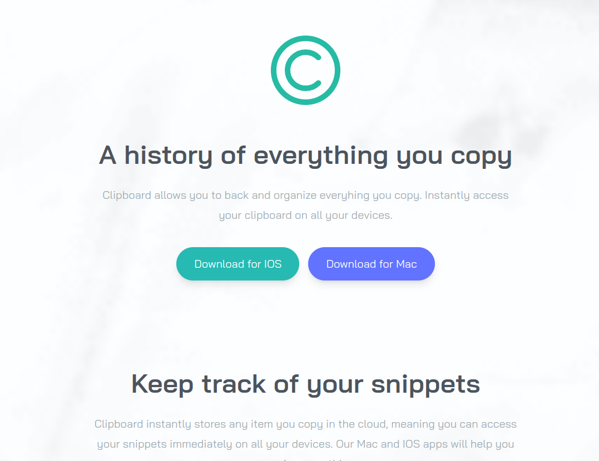
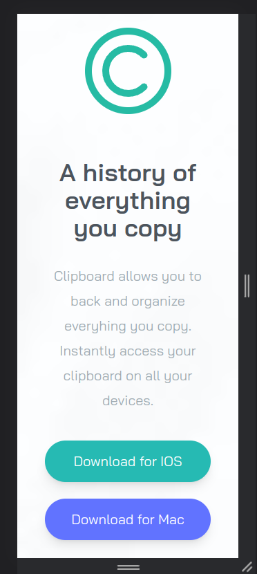

# nextjs-clipboard-website
Website created with Nextjs and Tailwindcss

## header pc


## header mobile


## Tool
1. NextJS - https://nextjs.org/
2. Tailwindcss - https://tailwindcss.com/

## Steps
clone this repo:
1. ```git clone https://github.com/wellpinho/nextjs-clipboard-website.git```
2. ```cd nextjs-clipboard-website/web```
3. ```pnpm i```
4. ```pnpm dev```
5. acccess the project: http://localhost:3000

## If you like my work, donate a coffee
[PAYPAL](https://www.paypal.com/donate/?hosted_button_id=DPS2FRCH25ZMJ)

## Created by Wellington Pinho
[Linkedin](https://www.linkedin.com/in/wellpinho/)
[Email] wellpinho@outlook.com

### Description
This site was developed in the tailwindcss course of professor brad traversy
[Link](https://www.udemy.com/course/tailwind-from-scratch)

### Plus
What I did differently made the site completely in NextJS with typescript all componentized.